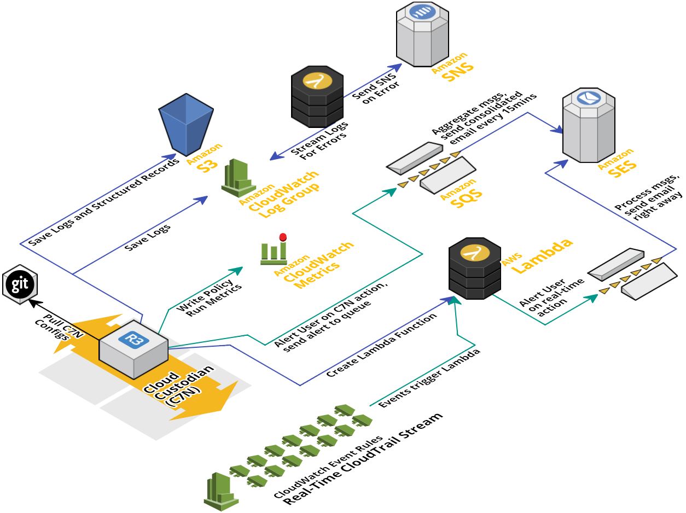

# Cloud Custodian Use Cases
**security-groups-unused.yml** : Retrieves unused security groups using regex <br>
**security-groups-unused-notify.yml** : Retrieves unused security groups using regex and notifies via email<br>
**iam.yml**                    : Retrieves iam users using regex <br>
**mfa.yml**                    : Retrieves iam users with MFA enabled <br>
**roles.yml**                  : Retrieves unused roles on EC2, Lambda, and ECS <br>
**admin-group.yml**            : Retrieves users in the group named 'Administrators' <br>
**mfa-unused.yml**             : Retrieves users who have MFA disabled in the group named 'Administrators' <br>
**emailer.yml**                : Sends email notification via Simple Email Service (SES) using notify action<br>
**ebs-garbage-collection.yml** : Deletes all unattached volumes<br>
**public-subnet-instance-audit-notify.yml** : Sends email notification via SES when EC2 instance launches in a public subnet<br>
**public-subnet-instance-audit-whitelist.yml** : Lambda that sends email notification via SES when EC2 instance launches in a public subnet and is NOT in the whitelist

# Cloud Custodian Architecture and AWS Services


# Usage Considerations
*emailer.yml* requires the custodian mailer described [here](https://github.com/capitalone/cloud-custodian/tree/master/tools/c7n_mailer). 

*ebs-garbage-collection.yml* can be run across all regions with the --region all option.<p>
 
 For example: <br>
 
```
 custodian run --dryrun -s out --region all ebs-garbage-collection.yml
```

# Quick Install
```
*** Install repository***
$ git clone https://github.com/capitalone/cloud-custodian

*** Install dependencies (with virtualenv) ***
$ virtualenv c7n_mailer
$ source c7n_mailer/bin/activate
$ cd cloud-custodian/tools/c7n_mailer
$ pip install -r requirements.txt

*** Install the extensions ***
$ python setup.py develop

*** Verify Installation ***
$ c7n-mailer
$ custodian

```

For more info, check out [Cloud Custodian in GitHub](https://github.com/capitalone/cloud-custodian)

# Tickets
[Custom msg-templates for c7n_mailer](https://github.com/capitalone/cloud-custodian/issues/1127)<br>
[Slack API and Token](https://github.com/capitalone/cloud-custodian/issues/2340)<br>
[Using ec2-instance-state, lessons around roles, how to view lambda logs, and more](https://github.com/capitalone/cloud-custodian/issues/2321)<br>
[How does garbage collection get enforced?](https://github.com/capitalone/cloud-custodian/issues/2384)<br>

# Troubleshooting Tips
Use 'custodian validate' to find syntax errors
Check 'name' of policy doesn't contain spaces
Check SQS to see if Custodian payload are entering the queue
Check cloud-custodian-mailer lambda CloudWatch rule schedule (5 minute by default)
Check Lambda error logs (this requires CloudWatch logging)
Remember to update the cloud-custodian-mailer lambda when making changes to a policy that uses notifications


## Schemas Used

### security-group

<pre>
(custodian) [hostname]$ custodian schema security-group
aws.security-group:
  actions: [auto-tag-user, delete, invoke-lambda, mark, mark-for-op, normalize-tag,
    notify, patch, put-metric, remove-permissions, remove-tag, rename-tag, tag, tag-trim,
    unmark, untag]
  filters: [and, default-vpc, diff, egress, event, ingress, json-diff, locked, marked-for-op,
    not, or, stale, tag-count, unused, used, value]
</pre>

### iam-user

<pre>
(custodian) [hostname]$ custodian schema iam-user
aws.iam-user:
  actions: [delete, invoke-lambda, notify, put-metric, remove-keys]
  filters: [access-key, and, credential, event, group, mfa-device, not, or, policy,
    value]
</pre>

### iam-role

<pre>
(custodian) [hostname]$ custodian schema iam-role
aws.iam-role:
  actions: [invoke-lambda, notify, put-metric]
  filters: [and, event, has-inline-policy, has-specific-managed-policy, no-specific-managed-policy,
    not, or, unused, used, value]
</pre>


## Artifacts

### security-groups-unused.yml
<pre>
(custodian) [hostname]$ custodian run --dryrun -s . security-groups-unused.yml
2018-04-13 20:02:01,043: custodian.policy:INFO policy: security-groups-unused resource:security-group region:us-east-1 count:29 time:0.30

(custodian) [hostname]$ more ./security-groups-unused/resources.json | grep 'GroupName\|GroupId'
(custodian) [hostname]$ more ./security-groups-unused/resources.json | grep GroupName\"\:
    "GroupName": "rds-launch-wizard-5",
    "GroupName": "rds-launch-wizard",
    "GroupName": "rds-launch-wizard-2",
    "GroupName": "launch-wizard-17",
    "GroupName": "launch-wizard-5",
    "GroupName": "launch-wizard-7",
    "GroupName": "launch-wizard-6",
    "GroupName": "launch-wizard-1",
    "GroupName": "rds-launch-wizard-4",
    "GroupName": "launch-wizard-4",
    "GroupName": "launch-wizard-2",
    "GroupName": "launch-wizard-3",
    etc.
</pre>

### iam.yml
<pre>
(custodian) [ec2-user@ip-10-100-0-195 custodian]$ custodian run --dryrun -s . iam.yml
2018-04-13 22:51:05,472: custodian.policy:INFO policy: iam-user-filter-policy resource:iam-user region:us-east-1 count:1 time:0.01

(custodian) [hostname]$ more ./iam-user-filter-policy/resources.json | grep UserName\"\:
    "UserName": "david.lin",
</pre>

### mfa.yml
<pre>
(custodian) [hostname]$ custodian run --dryrun mfa.yml -s .
2018-04-13 23:47:40,901: custodian.policy:INFO policy: mfa-user-filter-policy resource:iam-user region:us-east-1 count:15 time:0.01

(custodian) [hostname]$ more ./mfa-user-filter-policy/resources.json | grep UserName\"\:
    "UserName": "username_1",
    "UserName": "username_2,
    "UserName": "username_3",
    "UserName": "username_4",
     etc.
</pre>

### roles.yml
<pre>
(custodian) [hostname]$ custodian run --dryrun roles.yml -s .
2018-04-14 07:11:22,425: custodian.policy:INFO policy: iam-roles-unused resource:iam-role region:us-east-1 count:55 time:1.92

(custodian) [hostname]$ more ./iam-roles-unused/resources.json | grep RoleName
    "RoleName": "AmazonSageMaker-ExecutionRole-20180412T161207",
    "RoleName": "autotag-AutoTagExecutionRole-KA3LH5ARKJ2E",
    "RoleName": "autotag-AutoTagMasterRole-3VSL2AF3480E",
    "RoleName": "AWS-Cloudera-Infrastructu-ClusterLauncherInstanceR-1HUTDQJUYVGVE",
    etc.
</pre>

### admin-group.yml
<pre>
(custodian) [hostname]$ custodian run --dryrun admin_group.yml -s .
2018-04-14 07:54:08,198: custodian.policy:INFO policy: iam-users-in-admin-group resource:iam-user region:us-east-1 count:14 time:3.67

(custodian) [hostname]$ more ./iam-users-in-admin-group/resources.json | grep UserName
    "UserName": "username_1",
    "UserName": "username_2",
    "UserName": "username_3",
    "UserName": "username_4",
    etc.
</pre>

### mfa-unused.yml
<pre>
(custodian) [hostname]$ custodian run --dryrun mfa-unused.yml -s .
2018-04-14 08:13:07,214: custodian.policy:INFO policy: mfa-unused resource:iam-user region:us-east-1 count:2 time:2.54

(custodian) [ec2-user@ip-10-100-0-195 custodian]$ more ./mfa-unused/resources.json | grep UserName
    "UserName": "username_1",
    "UserName": "username_2"
</pre>

### public-subnet-instance-audit-notify.yml
<pre>
(custodian) $ custodian run -s . public-subnet-instance-audit-notify.yml
2018-05-04 01:07:56,937: custodian.policy:INFO Provisioning policy lambda public-subnet-instance-audit-notification
</pre>
